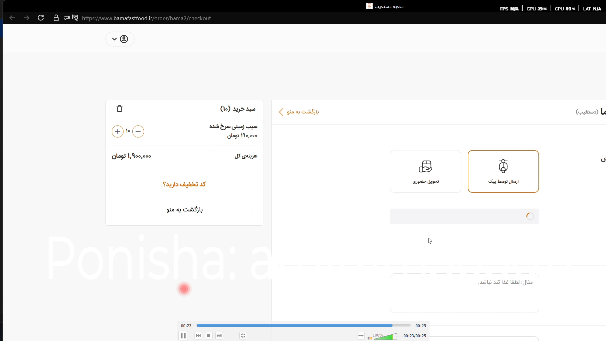

# Food Ordering Automation API

## معرفی پروژه

در این پروژه یک سیستم Backend مبتنی بر **FastAPI** طراحی و پیاده‌سازی شد که دو بخش اصلی دارد:

* **استخراج و پردازش داده از پلتفرم‌های سفارش غذا**
* **اتوماسیون فرآیند ثبت سفارش از طریق API**

هدف اصلی، ایجاد یک لایه یکپارچه برای دریافت اطلاعات غذا و در ادامه اجرای فرآیند سفارش بدون نیاز به انجام دستی تمام مراحل توسط کاربر بود.

---

## پیش‌نمایش پروژه

### تصاویر

> تصاویر پروژه در این بخش قرار می‌گیرند.

---

### ویدئوی عملکرد پروژه

[▶️ مشاهده ویدئوی عملکرد پروژه](./assets/demo.mp4)

> در صورت پشتیبانی GitHub از نمایش مستقیم ویدئو، فایل ویدئو را می‌توان مستقیماً در این بخش قرار داد. در غیر این صورت می‌توان از لینک ویدئو استفاده کرد.

---

## API استخراج اطلاعات غذا

سیستم امکان استخراج اطلاعات مختلف مربوط به غذاها و منو را فراهم می‌کند، از جمله:

* نام غذا
* قیمت
* توضیحات
* تصاویر
* نظرات
* گزینه‌ها و حالت‌های مختلف یک محصول

یکی از چالش‌های پروژه، پردازش ساختارهای پیچیده و تو در تو بود؛ برای مثال محصولاتی که دارای چند سایز یا گزینه متفاوت هستند.

داده‌های استخراج‌شده پس از پردازش به یک ساختار استاندارد تبدیل می‌شوند تا استفاده از آن‌ها در API ساده‌تر باشد.

---

## استخراج اطلاعات کافه

بخش دیگری از سیستم برای دریافت اطلاعات منوی کافه طراحی شده است.

این بخش اطلاعاتی مانند قیمت و مشخصات منو را استخراج کرده و در قالب یک ساختار استاندارد برای استفاده در API آماده می‌کند.

---

##  اتوماسیون ثبت سفارش

یکی از بخش‌های اصلی پروژه، اجرای خودکار فرآیند ثبت سفارش است.

فرآیند اتوماسیون شامل مراحل زیر است:

1. ورود اولیه به حساب کاربری
2. ذخیره Session برای استفاده‌های بعدی
3. جستجو در منو
4. انتخاب آیتم موردنظر
5. افزودن محصول به سبد خرید
6. ورود به سبد خرید
7. انتخاب آدرس
8. انتخاب روش پرداخت
9. ثبت نهایی سفارش

---

## مدیریت Session و Cache

برای جلوگیری از انجام مجدد فرآیند ورود در هر درخواست، Session احراز هویت ذخیره و برای درخواست‌های بعدی استفاده می‌شود.

همچنین داده‌های استخراج‌شده به‌صورت **JSON Cache** ذخیره می‌شوند تا API بتواند در زمان کوتاه‌تری پاسخ دهد و بار پردازشی سیستم کاهش پیدا کند.

---

## زمان‌بندی استخراج

فرآیند استخراج داده‌ها می‌تواند به‌صورت خودکار و دوره‌ای اجرا شود.

در نسخه پیاده‌سازی‌شده، امکان اجرای خودکار فرآیند استخراج **هر یک ساعت** در نظر گرفته شده و این زمان‌بندی قابلیت تنظیم دارد.

---

## مدیریت خطا و لاگ

برای بررسی وضعیت سیستم و شناسایی مشکلات، یک سیستم **Logging** پیاده‌سازی شده است.

خطاهای مربوط به استخراج، پردازش و اتوماسیون ثبت می‌شوند تا امکان بررسی و رفع مشکل ساده‌تر باشد.

---

## معماری API

بخش Backend با استفاده از **FastAPI** طراحی شده و APIهای ساختاریافته‌ای برای دسترسی به داده‌های استخراج‌شده و اجرای عملیات اتوماسیون ارائه می‌کند.

این ساختار باعث می‌شود سایر نرم‌افزارها بتوانند بدون نیاز به دسترسی مستقیم به منبع داده، از سرویس API استفاده کنند.

---

## بهینه‌سازی سیستم

برای بهبود عملکرد و کاهش پردازش‌های تکراری، از روش‌هایی مانند:

* Cache کردن داده‌ها
* ذخیره خروجی به‌صورت JSON
* استفاده مجدد از Session
* زمان‌بندی پردازش‌ها
* مدیریت خطا و Logging

استفاده شده است.

---

## مشخصات پروژه

| مشخصات                | توضیحات                        |
| --------------------- | ------------------------------ |
| **نقش من**               | توسعه‌دهنده کامل               |
| **نوع سرویس**         | برنامه‌نویسی و توسعه نرم‌افزار |
| **مدت انجام**         | ۱۰ روز                         |
| **محدوده قیمت پروژه** | ۵,۰۰۰,۰۰۰ تا ۱۰,۰۰۰,۰۰۰ تومان  |

---

## فناوری‌های استفاده‌شده

* **Python**
* **FastAPI**
* **Requests**
* **BeautifulSoup**
* **Web Scraping**
* **Camoufox / Browser Automation**
* **JSON**
* **Caching**
* **Logging**
* **Scheduler**

---

## نتیجه پروژه

نتیجه این پروژه، ایجاد یک Backend یکپارچه برای **استخراج داده‌های سفارش غذا، استانداردسازی اطلاعات، ارائه API و اجرای خودکار فرآیند ثبت سفارش** بود.

سیستم با استفاده از Cache، Session Management و زمان‌بندی خودکار، امکان پردازش دوره‌ای داده‌ها و ارائه سریع‌تر اطلاعات از طریق API را فراهم می‌کند.

---

## سفارش پروژه مشابه

اگر به سیستم‌های **Web Scraping، API، Backend، Browser Automation یا اتوماسیون فرآیندهای آنلاین** نیاز دارید، می‌توانید برای ثبت سفارش و دریافت مشاوره با من در ارتباط باشید.

 **[ثبت سفارش پروژه](https://amiryousefimehr.ir/request-project)**
---

## مشاهده نمونه‌کارهای بیشتر

 **[مشاهده رزومه و نمونه‌کارهای من](https://amiryousefimehr.ir/projects)**
---
